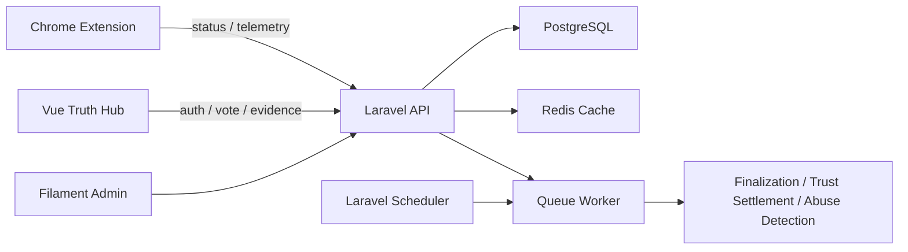

# TruthShield API

TruthShield is an open-source news credibility system built around weighted community review, evidence-first voting, transparent moderation, and browser-extension delivery.

This repository contains the Laravel backend: API, admin panel, reputation engine, evidence pipeline, anti-abuse logic, governance records, donation backend, exports, and operational tooling.

> TruthShield does not delete news, block readers, or decide truth by authority. It shows weighted community signals beside news content and makes the reasoning auditable.

## What It Does

- Normalizes news URLs and stores stable fingerprints.
- Returns low-latency article status for browser-extension tooltips and banners.
- Lets authenticated users vote with trust-weighted scores.
- Requires evidence for negative labels and supports external image hosts, cloud drives, YouTube, archive links, related reports, and official records.
- Freezes each article result after a 72-hour voting window.
- Tracks evidence usefulness and feeds it into future trust-score settlement.
- Detects suspicious coordinated behavior and lowers abusive account weight.
- Provides a Filament admin panel for data review, moderation, trust adjustment, evidence reports, domain coverage, YouTube channels, donations, and operational health.
- Publishes transparency, leaderboard, evidence-library, OpenAPI, export, and readiness endpoints.

## Open Source Impact

TruthShield is public-interest infrastructure for news credibility and civic context. It does not block articles, delete content, or decide truth by authority. It adds a transparent layer beside news pages so readers can inspect weighted community labels, evidence links, event timelines, reader reactions, and moderation history before forming their own judgment.

The project is already deployed in production:

- Public web app: <https://truth-shield.otus.tw>
- API health endpoint: <https://truth-shield-api.otus.tw/api/system/health>
- Public API documentation: <https://truth-shield.otus.tw/api-docs>

This backend is the core of the open-source system. It contains the trust-weighted voting engine, evidence-first review flow, anti-abuse logic, event taxonomy and progress tracking, public moderation records, transparency endpoints, admin tooling, production health checks, and deployment scripts. The companion frontend repository provides the website, iframe panels, and Chrome extension UI.

## Maintenance and Codex Use

TruthShield is actively maintained as a small open-source project with production operations, queue workers, scheduled jobs, event status reviews, admin workflows, and extension releases. Recent maintenance includes event categorization, progress status governance, reader reactions, trust-score achievements, Open Graph previews, public documentation, donation flows, and production data sweeps.

Codex and API credits would be used for core open-source maintenance work:

- Review pull requests and high-risk backend changes before deployment.
- Triage issues affecting production API, queues, scheduler, admin panel, and extension integrations.
- Generate release notes, migration summaries, and deployment checklists.
- Audit trust-weighting, moderation, anti-abuse, and evidence-settlement logic.
- Automate public-interest maintenance tasks such as event-status review, source-quality checks, documentation updates, and API contract regression checks.

## Product Principles

- **No censorship:** external news remains readable at the original site.
- **Evidence first:** negative claims require a public evidence URL and short explanation.
- **One person, one article entry:** each user has one vote/evidence record per article, editable before the cutoff.
- **Weighted trust:** vote impact is `trust_score * identity_multiplier * abuse_multiplier`.
- **Frozen results:** finalized articles read from snapshots instead of dynamic recomputation.
- **Transparent governance:** moderation, appeals, automation, and trust actions leave records.

## Architecture



## Tech Stack

- Laravel 11
- Laravel Sanctum
- PostgreSQL
- Redis
- Filament admin panel
- Database queue workers
- Docker-first local development

## Key API Areas

| Area | Endpoint |
| --- | --- |
| Article status | `GET /api/news/status?url=...` |
| Vote with evidence | `POST /api/vote` |
| Evidence list | `GET /api/news/evidence?url=...` |
| Evidence reaction/report | `POST /api/evidence/{vote}/reaction`, `POST /api/evidence/{vote}/report` |
| Tags | `GET /api/tags?locale=zh-TW` |
| News domains | `GET /api/news-domains` |
| Transparency | `GET /api/transparency` |
| Evidence library | `GET /api/evidence-library` |
| Profile | `GET /api/me/profile` |
| OpenAPI | `GET /api/openapi.json` |
| Health | `GET /api/system/health` |
| Donations | `POST /api/donations/ecpay` |

## Local Development

If this repository is checked out inside the full TruthShield workspace, start all local services from the workspace root:

```bash
docker compose up --build
```

Default local services:

- API: `http://127.0.0.1:18080`
- Admin: `http://127.0.0.1:18080/admin`
- Web app: `http://127.0.0.1:15173`

Backend-only setup:

```bash
composer install
cp .env.example .env
php artisan key:generate
php artisan migrate --seed
php artisan serve --host=0.0.0.0 --port=8000
```

Local seeded admin:

```text
admin@truthshield.local / admin123456
```

This account is for local development only. Create a separate production admin with the command below.

Create a production admin:

```bash
php artisan truthshield:bootstrap-admin \
  --email=admin@example.com \
  --name="TruthShield Admin" \
  --password='use-a-long-random-password'
```

## Operations

Common commands:

```bash
php artisan truthshield:preflight-production
php artisan truthshield:check-production-env
php artisan truthshield:finalize-news --settle
php artisan truthshield:warm-cache
php artisan truthshield:seed-launch-policies
php artisan truthshield:expire-pending-donations --hours=24
php artisan truthshield:stress-status --requests=1000
php artisan truthshield:explain-hot-queries
```

Smoke test an API deployment:

```bash
BASE_URL=https://api.truthshield.example ./deploy/smoke-test.sh
```

Queue worker:

```bash
php artisan queue:work redis --sleep=1 --tries=3 --timeout=90
```

Scheduler:

```bash
php artisan schedule:run
```

In production, the API can run on Cloud Run while a shared worker machine runs queue workers and scheduler cron.

The Cloud Build config can also update a queue VM after pushing the API image. Set trigger substitutions:

```text
_QUEUE_DEPLOY_ENABLED=true
_QUEUE_INSTANCE=<queue-vm-name>
_QUEUE_ZONE=<queue-vm-zone>
_QUEUE_ENV_FILE=<absolute-env-file-path-on-queue-host>
_QUEUE_CONTAINER_NAME=truthshield-worker
_QUEUE_DOCKER_NETWORK=<docker-network-name>
_QUEUE_SSH_USER=<ssh-user>
_QUEUE_IMAGE_CLEANUP_KEEP=3
```

Keep production substitution values in the Cloud Build trigger or deployment environment, not in the public repository.

The queue host must have Docker, permission to pull from Artifact Registry, a populated env file, and a deploy user that can run Docker. If PostgreSQL and Redis run in Docker, put the worker on the same Docker network and set `DB_HOST` / `REDIS_HOST` to their container names in `worker.env`. The remote deploy script pulls the same image, runs migration/seed/bootstrap commands once, starts `queue:work redis`, installs a crontab entry that runs `schedule:run` through the worker container, and removes older TruthShield images after a successful worker start.

## Cloud Run Container

The Dockerfile listens on Cloud Run's default port `8080`.

```bash
docker build -t truthshield-api .
docker run --rm -p 8080:8080 \
  -e PORT=8080 \
  -e APP_KEY=base64:replace-me \
  truthshield-api
```

For dirty deployment, the container can boot before all integrations are configured. API routes that need PostgreSQL or Redis will fail until production environment variables are attached.

## License

TruthShield API is open source under the [MIT License](./LICENSE).

## Production Dependencies

Required:

- PostgreSQL
- Redis
- HTTPS API origin
- HTTPS frontend origin
- Queue worker host
- Scheduler host or cron
- Secure `APP_KEY`
- Production admin account

Optional for launch:

- Facebook / Google / GitHub OAuth credentials
- ECPay merchant credentials
- Mail provider credentials
- External evidence upload provider
- Chrome Web Store listing

The system can deploy without optional keys by keeping dev login disabled in production and leaving optional integrations off.

## Evidence Safety

TruthShield does not host evidence images or documents. Evidence is stored as external URLs plus metadata, safety status, preview information, trust-source classification, and quality score.

The backend blocks private and localhost evidence URLs to reduce SSRF risk.

## Testing

```bash
php artisan test
```

Targeted examples:

```bash
php artisan test --filter=UrlFingerprintServiceTest
php artisan test --filter=health_and_transparency_include_operational_defense_fields
```

## Related Repository

- TruthShield Web and Chrome extension: `truth-shield-web`

## Status

The project is in deployable beta form. Core local functionality is implemented; production readiness depends on infrastructure, domain, OAuth/payment/email decisions, and real-world extension compatibility testing.
